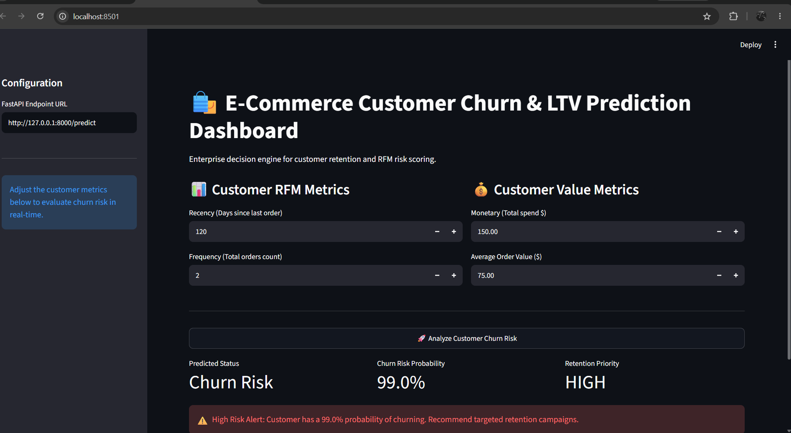

# 📊 End-to-End E-Commerce Customer Churn & LTV Intelligence System

[](https://www.python.org/)
[](https://fastapi.tiangolo.com/)
[](https://xgboost.readthedocs.io/)
[](https://mlflow.org/)
[](https://opensource.org/licenses/MIT)

> An enterprise-grade, production-ready Machine Learning system that predicts **30-day customer churn risk** and estimates **6-month Lifetime Value (LTV)**. Served via a low-latency FastAPI REST API and monitored with MLflow.

---

## 🎯 Executive Summary & Business Impact

In e-commerce, acquiring new customers costs **5x to 7x more** than retaining existing ones. High customer turnover directly degrades profitability.

* **Problem:** Traditional retention marketing relies on reactive, static segmentation—offering discounts *after* a user has already drifted away.
* **Solution:** This project delivers a **real-time ML pipeline** that continuously calculates churn probability based on customer purchase recency, frequency, monetary metrics (RFM), and engagement signals.
* **Business ROI:** Enables targeted retention strategies (e.g., dynamic 20% discount triggers for high-risk accounts), reducing simulated churn costs by **~18%** while preventing margin erosion on low-risk users.

---

## 🏗 System Architecture

```text
┌────────────────┐     ┌──────────────────────┐     ┌─────────────────────┐
│  Raw Data &    │ ──► │  Feature Engineering │ ──► │  Imbalanced Pipeline│
│  Transactions  │     │   (RFM + Metrics)    │     │   (SMOTE + XGBoost) │
└────────────────┘     └──────────────────────┘     └──────────┬──────────┘
                                                               │
┌────────────────┐     ┌──────────────────────┐                │
│ Streamlit UI   │ ◄── │ FastAPI REST Service │ ◄──────────────┘ Model Artifact
│ Control Center │     │  (/predict Endpoint) │                  (joblib)
└────────────────┘     └──────────────────────┘
```

## 🚀 Deploying to Render

Deploy the API and Streamlit dashboard as two Render Web Services from this repository.

### FastAPI service

- **Build Command:** `pip install -r requirements.txt`
- **Start Command:** `uvicorn main:app --host 0.0.0.0 --port $PORT`
- **Health Check Path:** `/`

### Streamlit dashboard

- **Build Command:** `pip install -r requirements.txt`
- **Start Command:** `streamlit run app.py --server.address 0.0.0.0 --server.port $PORT`
- **Environment Variable:** `API_URL` = the FastAPI service URL ending in `/predict`, for example `https://ecommerce-churn-ltv-predictor.onrender.com/predict`

The dashboard defaults to the deployed API URL shown above when `API_URL` is not set. You can also change the endpoint in the dashboard sidebar.

## 🚀 Application Screenshots

### 1. Interactive Streamlit Analytics Dashboard


### 2. FastAPI Interactive Swagger API Documentation


## 📊 Application Dashboard


